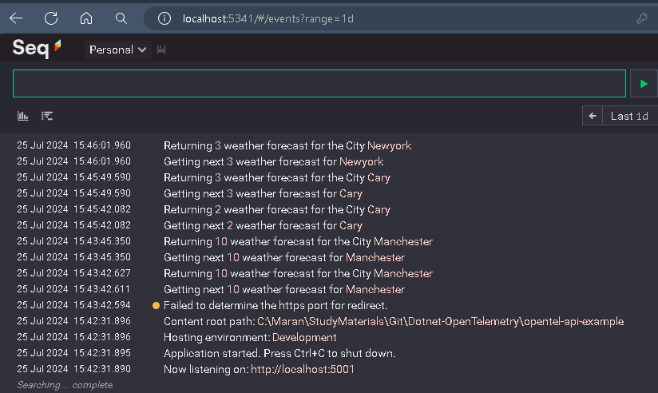
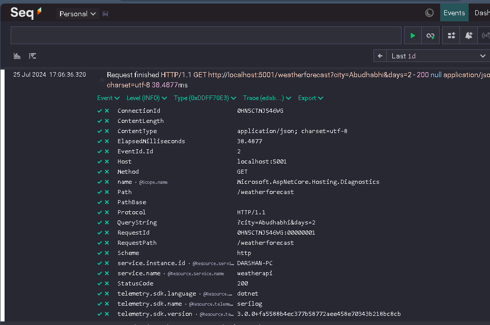

# Setting up OpenTelementry logging with .Net, Serilog and Seq


 ```bash
# Create the new dotnet web api project
> dotnet new webapi -n opentel-api-example

#Add the nuget pacakges - ConsoleExporter
> dotnet add package OpenTelemetry.Exporter.Console --version 1.9.0

> dotnet add package OpenTelemetry.Exporter.OpenTelemetryProtocol --version 1.9.0

> dotnet add package OpenTelemetry.Instrumentation.AspNetCore --version 1.9.0

# Adding Serilog instead of default logging 
> dotnet add package Serilog.Extensions.Logging

> dotnet add package Serilog.Sinks.Console

> dotnet add package Serilog.AspNetcore

> dotnet add package Serilog.Sinks.OpenTelemetry --version 3.0.0

```


## Push Default Logging to Seq


### used Serilog to Seq
